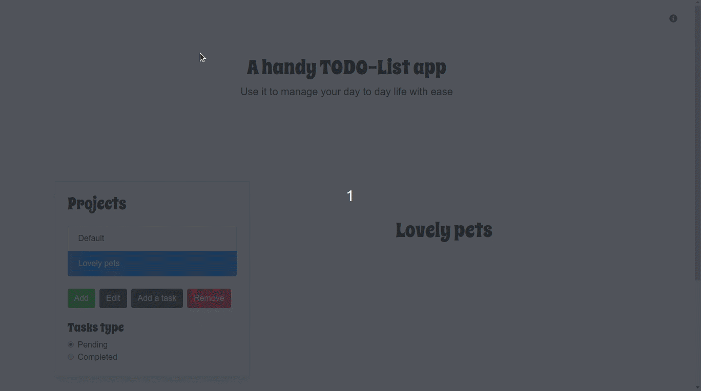

# todo-list

This project is yet another TODO list made with JavaScript, it is a good
tool to use when you want to focus on getting things done. Basic features
of a TODO list are present, so you may use this project to create your
own TODO list application and change it to your liking.



## Features

### General

- Projects
- Pending tasks
- Completed tasks
- Default project
- Tasks edition
- Tasks deletion
- Projects addition
- Projects deletion
- Tasks mode switching
- Completed tasks
- Tasks importance
- Tasks due date
- Tasks completed date

### Technical

- **webpack** since the beginning
- **OO** design
- Use of `localStorage`
- Data is saved as JSON
- **Bootstrap** 4

## Setup

### Requirements

- [node](https://nodejs.org/en/)

### Steps

1. Clone the repo

```bash
git clone https://github.com/santiago-rodrig/todo-list.git
```

2. Get the dependencies

```bash
npm install
```

3. Start the server

```bash
npm run server
```

## License

This project is licensed under the
[MIT](./LICENSE) license, which
basically means that you can do whatever you want with the code under the
condition of giving credit to its author and noticing the license.

## Credits

This project was developed by [srodrig](https://github.com/santiago-rodrig) and
[mrnadaara](https://github.com/mrnadaara).

## Contact

You can reach me out at the following URLs

- [Github](https://github.com/santiago-rodrig)
- [LinkedIn](https://www.linkedin.com/in/santiago-andres-rodriguez-marquez)
- [AngelList](https://angel.co/u/santiago-andres-rodriguez-marquez)
- [santo1996.29@gmail.com](mailto:santo1996.29@gmail.com)
